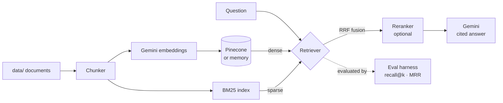

<div align="center">

# 📚 rag-knowledge-assistant

**Real-stack Retrieval-Augmented Generation — Gemini + Pinecone, hybrid retrieval, and the eval
harness that proves it works.**

Hybrid retrieval (dense + BM25, fused with RRF) · optional cross-encoder reranking · grounded,
cited answers · recall@k / MRR evaluation · a real document corpus · hands-on learning tasks.

</div>

---

## ⚡ Quick Start

```bash
git clone https://github.com/ArunRyzen/rag-knowledge-assistant.git && cd rag-knowledge-assistant
uv sync --extra dev
cp .env.example .env      # fill in GEMINI_API_KEY and PINECONE_API_KEY (see Setup below)

uv run rag ingest         # chunk + embed data/ and upsert into Pinecone (run once)
uv run rag ask "Why does hybrid retrieval beat dense-only?"
uv run rag eval           # compare dense vs sparse vs hybrid retrieval, with numbers
```

## Problem

RAG is the most-deployed pattern in production AI — and the easiest to do badly. Naive "embed +
nearest-neighbour" misses exact keywords, buries the right passage, and gives no way to tell whether
a change helped or hurt. This project is RAG done the way teams actually ship it: **hybrid retrieval**
(semantic *and* lexical), a **rerank** stage, **grounded, cited answers**, and — the centerpiece — a
**retrieval evaluation harness** so quality is a number, not a vibe.

## What it does

```bash
rag ask "How are two ranked lists combined into one?"
# → Reciprocal Rank Fusion combines lists by rank... [1]
#   Sources: [1] hybrid-rrf (score=0.033)

rag eval        # compare retrieval strategies on a labelled golden set
```
```
dense            recall@5=0.88  MRR=0.79  (n=16)
sparse           recall@5=0.94  MRR=0.86  (n=16)
hybrid           recall@5=1.00  MRR=0.93  (n=16)
hybrid+rerank    recall@5=1.00  MRR=0.97  (n=16)
```
*(Illustrative — run it yourself on the bundled corpus.)*

## Architecture


```mermaid
flowchart LR
    D[data/ documents] --> C[Chunker]
    C --> E[Gemini embeddings]
    E --> VS[(Pinecone<br/>or memory)]
    C --> BM[BM25 index]
    Q[Question] --> R{Retriever}
    VS -->|dense| R
    BM -->|sparse| R
    R -->|RRF fusion| RR[Reranker<br/>optional]
    RR --> G[Gemini<br/>cited answer]
    R -. evaluated by .-> EV[Eval harness<br/>recall@k · MRR]
```

Every stage sits behind a small interface (`Embedder`, `VectorStore`, `Reranker`, `Answerer`), so
backends swap freely — and the test suite runs fully offline by injecting stub implementations of
the same protocols. Full reasoning in [`docs/architecture.md`](docs/architecture.md).

## Tech stack

`Python 3.12` · `Pydantic v2` · `NumPy` · `Gemini` (embeddings + generation) · `Pinecone`
(serverless vector DB) · `FastAPI` · `Typer` · `uv` · `ruff` · `mypy` · `pytest` · `Docker` ·
`GitHub Actions`

## Setup

Two free keys:

1. **Gemini** — [aistudio.google.com/apikey](https://aistudio.google.com/apikey). Powers both
   embeddings (`gemini-embedding-001`, 768-dim) and answers (`gemini-2.5-flash`).
2. **Pinecone** — [app.pinecone.io](https://app.pinecone.io). Create a serverless index
   (dimension **768**, metric **cosine**) — or let `rag ingest` create it for you.

```bash
cp .env.example .env
# fill in: GEMINI_API_KEY, PINECONE_API_KEY, PINECONE_INDEX (VECTOR_STORE=pinecone is the default there)
```

Prefer zero infrastructure for a quick experiment? Set `VECTOR_STORE=memory` — same pipeline,
in-process vectors, nothing persisted between runs.

## The corpus is the study guide

The bundled `data/` folder contains real documents about RAG itself — embeddings, chunking, BM25,
RRF, reranking, vector databases, evaluation, grounded generation, and a real **PDF** on query
transformation (extracted with `pypdf`, then chunked like everything else). Every query you
practice returns an answer worth reading. Swap in your own `.md`/`.txt`/`.pdf` folder with
`--data`. The full data journey — PDF on disk to cited answer — is written up step by step in
[`docs/end-to-end-flow.md`](docs/end-to-end-flow.md).

**[`tasks/README.md`](tasks/README.md) is the learning path**: 8 hands-on exercises (chunk-size
experiments, growing the golden set, forcing refusals, implementing multi-query retrieval), each
mapped to the interview question it prepares you for.

## Usage

**CLI**
```bash
rag ingest                                # chunk + embed data/ into Pinecone (run once / on change)
rag ask "Which algorithm makes ANN search fast?"          # query the corpus
rag ask "..." --data ./my_docs --mode hybrid --rerank     # your own docs / other modes
rag eval                                  # dense vs sparse vs hybrid vs +rerank
```

**API**
```bash
uv run uvicorn rag_assistant.api:app --reload
# POST /ask {"question": "...", "mode": "hybrid"}   POST /ingest {"doc_id","text"}
# GET  /eval     GET /health     GET /metrics
```

**Library**
```python
from rag_assistant.config import load_settings
from rag_assistant.factory import build_pipeline

pipe = build_pipeline(load_settings())
pipe.ingest("notes", open("notes.md").read())
print(pipe.ask("...", mode="hybrid", rerank=True).text)
```

## Peek behind the curtain (`LLM_DEBUG`)

Set `LLM_DEBUG=1` (env var or `.env` line; the env var wins) and every embedder and answerer call
prints a plain request/response block to stderr — the exact system prompt, contexts, and answer.
API keys are never logged.

```powershell
$env:LLM_DEBUG = "1"; uv run rag ask "What does the k1 parameter control?"
Remove-Item Env:LLM_DEBUG
```

## How it works (the parts interviewers ask about)

1. **Chunking** — recursive, structure-aware splitting with overlap, so a fact split across a
   boundary still lives in one chunk.
2. **Hybrid retrieval** — dense (cosine over Gemini embeddings) **and** sparse (BM25 lexical),
   fused with **Reciprocal Rank Fusion**. RRF combines by *rank*, so it doesn't matter that cosine
   and BM25 are on different scales. Hybrid beats either alone.
3. **Reranking (optional)** — a cross-encoder re-scores the top candidates by reading query + passage
   *together*. Expensive, so: retrieve broadly, rerank precisely.
4. **Grounded generation** — the model answers **only** from numbered contexts, cites them with
   `[n]` markers (which are parsed back into real citations), or says it doesn't know.
5. **Evaluation** — recall@k and MRR over a labelled golden set, comparing every retrieval mode.

## The ingest/query split (worth understanding)

`rag ingest` is the write path: chunk → embed → upsert to Pinecone. It runs once (and again when
documents change); upserts are idempotent by chunk id. `rag ask`/`rag eval` are the read path:
dense search hits the persistent Pinecone index, while the BM25 side is rebuilt in-process from
`data/` (chunking is deterministic, so both sides see identical chunks — and rebuilding BM25 costs
zero API calls). Pinecone writes are eventually consistent: freshly ingested records can take a few
seconds to become searchable.

## Testing

```bash
uv run ruff check . && uv run mypy . && uv run pytest
```
The suite runs fully offline — no keys, no network. Production code has one real path; tests
inject offline stubs (`tests/conftest.py`) that implement the same `Embedder`/`Answerer`
protocols, plus mocked Gemini SDK clients to verify the live call contracts.

## Serving & deployment

Production-serving features are built into the API (full guide:
[`docs/deployment.md`](docs/deployment.md)):
- **Semantic response cache** — paraphrased repeats skip retrieval + generation (`"cached": true`).
- **Rate limiting** — per-client sliding window (HTTP 429 over the limit).
- **`GET /metrics`** — request count, cache hit rate, cache size, rate-limit config.

```bash
docker build -t rag-knowledge-assistant .
docker run -p 8000:8000 --env-file .env rag-knowledge-assistant
```

## Future improvements
- Query-side techniques: multi-query expansion (Task 6 in `tasks/`), HyDE, query rewriting.
- Faithfulness / answer-quality evals (LLM-as-judge) on top of the retrieval metrics.
- Managed sparse/hybrid search (Pinecone sparse vectors) so BM25 persists too.
- Streaming answers and PDF/OCR ingestion.

## Learn more
- [`tasks/README.md`](tasks/README.md) — **start here to learn** — 13 exercises + a 7-day interview plan
- [`docs/end-to-end-flow.md`](docs/end-to-end-flow.md) — the full data journey, PDF → cited answer
- [`docs/learning-resources.md`](docs/learning-resources.md) — curated official docs & papers, staged
- [`docs/code-walkthrough.md`](docs/code-walkthrough.md) — plain-English, file-by-file tour
- [`docs/architecture.md`](docs/architecture.md) — design decisions & trade-offs
- [`docs/interview-questions.md`](docs/interview-questions.md) — RAG Q&A this project answers
- [`docs/lessons-learned.md`](docs/lessons-learned.md)

## License

[MIT](LICENSE) · Part of my [AI_Engineer](https://github.com/ArunRyzen/AI_Engineer) portfolio (Milestone 2).
