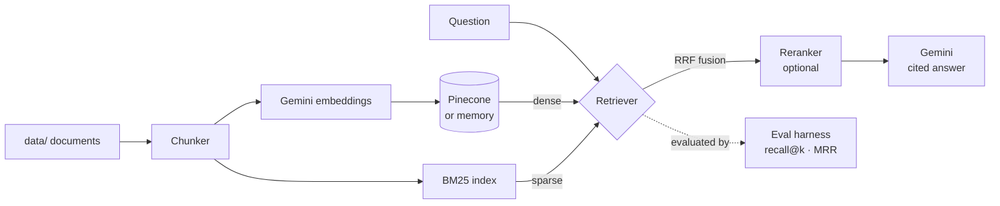

<div align="center">

# 📚 rag-knowledge-assistant

**Real-stack Retrieval-Augmented Generation — Gemini + Pinecone, hybrid retrieval, and the eval
harness that proves it works.**

Hybrid retrieval (dense + BM25, fused with RRF) · optional cross-encoder reranking · grounded,
cited answers · recall@k / MRR evaluation · a real document corpus · hands-on learning tasks.

</div>

---

## 🚀 How to run — step by step

**Step 1 — Get the code and install** (needs [uv](https://docs.astral.sh/uv/); one time)
```powershell
git clone https://github.com/ArunRyzen/rag-knowledge-assistant.git
cd rag-knowledge-assistant
uv sync --extra dev
```

**Step 2 — Add your two free API keys** (one time)
```powershell
copy .env.example .env
# then edit .env and fill in:
#   GEMINI_API_KEY    → free key from https://aistudio.google.com/apikey
#   PINECONE_API_KEY  → free key from https://app.pinecone.io  (API Keys page)
```

**Step 3 — Ingest the textbook** (run once, and again whenever documents change)
```powershell
uv run rag ingest            # chunk + embed the book, upsert vectors into Pinecone
uv run rag ingest --reset    # use this instead when you changed/removed documents
```

**Step 4 — Ask questions**
```powershell
uv run rag ask "Who is Valli's pet?"
uv run rag ask "What does the rat build?" --mode sparse    # try dense / sparse / hybrid
```

**Step 5 — Chat with the education bot** (multi-turn, guardrails, web fallback)
```powershell
uv run rag chat
# you> What does Chittu eat?          → answered from the book, with sources
# you> Why is the sky blue?           → not in the book → web-search agent answers
# you> Which movie should I watch?    → refused: education questions only
# you> exit
```
Note: the free Gemini tier allows ~5 model calls/minute and each chat turn uses 3–4,
so roughly one chat turn per minute — the bot tells you politely when to wait.

**Step 6 — Measure retrieval quality**
```powershell
uv run rag eval              # dense vs sparse vs hybrid vs +rerank on the golden set
```

**Step 7 — See inside every AI call** (the best way to learn)
```powershell
$env:LLM_DEBUG = "1"
uv run rag ask "Who is Valli's pet?"     # watch prompts + agent verdicts on stderr
Remove-Item Env:LLM_DEBUG
```

**Step 8 — Run the API server** (optional)
```powershell
uv run uvicorn rag_assistant.api:app --reload
# open http://127.0.0.1:8000/docs and call /ask, /eval, /metrics from the browser
```

**Step 9 — Use your own documents** (optional; any folder of .md/.txt/.pdf)
```powershell
uv run rag ask "your question" --data .\my_docs
```

**Step 10 — Run the checks** (offline, no API cost)
```powershell
uv run ruff check .; uv run mypy .; uv run pytest
```

Then open **[`tasks/README.md`](tasks/README.md)** — the hands-on learning tasks — and start
with Task 1.

## Problem

RAG is the most-deployed pattern in production AI — and the easiest to do badly. Naive "embed +
nearest-neighbour" misses exact keywords, buries the right passage, and gives no way to tell whether
a change helped or hurt. This project is RAG done the way teams actually ship it: **hybrid retrieval**
(semantic *and* lexical), a **rerank** stage, **grounded, cited answers**, and — the centerpiece — a
**retrieval evaluation harness** so quality is a number, not a vibe.

## What it does

```bash
rag ask "What does Chittu eat?"
# → Chittu eats grass, and also bananas, leaves and roots. [1]
#   Sources: [1] unit-1-my-pet (score=0.033)

rag eval        # compare retrieval strategies on a labelled golden set
```
```
dense            recall@5=0.92  MRR=0.83  (n=12)
sparse           recall@5=0.92  MRR=0.88  (n=12)
hybrid           recall@5=1.00  MRR=0.94  (n=12)
hybrid+rerank    recall@5=1.00  MRR=0.94  (n=12)
```
*(Illustrative — run it yourself on the bundled corpus.)*

## Architecture


```mermaid
flowchart LR
    D[data/ documents] --> C[Chunker]
    C --> E[Gemini embeddings]
    E --> VS[(Pinecone<br/>or memory)]
    C --> BM[BM25 index]
    Q[Question] --> R{Retriever}
    VS -->|dense| R
    BM -->|sparse| R
    R -->|RRF fusion| RR[Reranker<br/>optional]
    RR --> G[Gemini<br/>cited answer]
    R -. evaluated by .-> EV[Eval harness<br/>recall@k · MRR]
```

Every stage sits behind a small interface (`Embedder`, `VectorStore`, `Reranker`, `Answerer`), so
backends swap freely — and the test suite runs fully offline by injecting stub implementations of
the same protocols. Full reasoning in [`docs/how-it-works.md`](docs/how-it-works.md).

## Tech stack

`Python 3.12` · `Pydantic v2` · `NumPy` · `Gemini` (embeddings + generation) · `Pinecone`
(serverless vector DB) · `FastAPI` · `Typer` · `uv` · `ruff` · `mypy` · `pytest` · `Docker` ·
`GitHub Actions`

## Setup

Two free keys:

1. **Gemini** — [aistudio.google.com/apikey](https://aistudio.google.com/apikey). Powers both
   embeddings (`gemini-embedding-001`, 768-dim) and answers (`gemini-2.5-flash`).
2. **Pinecone** — [app.pinecone.io](https://app.pinecone.io). Create a serverless index
   (dimension **768**, metric **cosine**) — or let `rag ingest` create it for you.

```bash
cp .env.example .env
# fill in: GEMINI_API_KEY, PINECONE_API_KEY, PINECONE_INDEX (VECTOR_STORE=pinecone is the default there)
```

Prefer zero infrastructure for a quick experiment? Set `VECTOR_STORE=memory` — same pipeline,
in-process vectors, nothing persisted between runs.

## The corpus: a real State Board textbook

The `data/` folder holds the **Tamil Nadu State Board (Samacheer Kalvi) Class 1 English book,
Term 1** — extracted from the official PDF with `pypdf` and split into one file per unit
(`unit-1-my-pet`, `unit-2-play-time`, `unit-3-families`). The bot answers questions a child
would be quizzed on: *Who is Valli's pet? What does the rat build? Where does Nila live?* The
golden eval set (`golden.py`) is 12 labelled questions from the book. Swap in any
`.md`/`.txt`/`.pdf` folder with `--data`. The full data journey — textbook PDF to cited answer
— is written up step by step in [`docs/how-it-works.md`](docs/how-it-works.md).

**[`tasks/README.md`](tasks/README.md) is the learning path**: 13 hands-on exercises, each
mapped to the interview question it prepares you for, plus a 7-day plan.

## Use it as a library

```python
from rag_assistant.config import load_settings
from rag_assistant.factory import build_pipeline

pipe = build_pipeline(load_settings())
pipe.ingest("notes", open("notes.md").read())
print(pipe.ask("...", mode="hybrid", rerank=True).text)
```

## How it works (the parts interviewers ask about)

1. **Chunking** — recursive, structure-aware splitting with overlap, so a fact split across a
   boundary still lives in one chunk.
2. **Hybrid retrieval** — dense (cosine over Gemini embeddings) **and** sparse (BM25 lexical),
   fused with **Reciprocal Rank Fusion**. RRF combines by *rank*, so it doesn't matter that cosine
   and BM25 are on different scales. Hybrid beats either alone.
3. **Reranking (optional)** — a cross-encoder re-scores the top candidates by reading query + passage
   *together*. Expensive, so: retrieve broadly, rerank precisely.
4. **Grounded generation** — the model answers **only** from numbered contexts, cites them with
   `[n]` markers (which are parsed back into real citations), or says it doesn't know.
5. **Evaluation** — recall@k and MRR over a labelled golden set, comparing every retrieval mode.

## The education chatbot (multi-agent workflow)

`rag chat` composes five specialized agents — each one focused LLM call:

```
message → INPUT GUARD → CONDENSER → RAG (book) → GROUNDING CHECK → reply from book
          education-only  follow-up →                 │ NO_ANSWER / UNGROUNDED
          blocks injection  standalone Q              ▼
                                              WEB SEARCH AGENT → "(from web search) ..."
```

- **Education only**: movies, gossip, shopping → refused before retrieval even runs.
- **Book first**: answers come from the textbook, cited by unit.
- **Web fallback**: when the checker rules the book doesn't cover it (NO_ANSWER) or the model
  said something unsupported (UNGROUNDED), a web-search agent — Gemini with Google Search
  grounding — answers instead, clearly labelled.
- Follow-ups (*"what does she eat?"*) are condensed into standalone questions from history.

The whole workflow is offline-testable with scripted stub agents (`tests/test_chat.py`). See
`src/rag_assistant/chat.py` — the flow diagram is at the top of the file.

## The ingest/query split (worth understanding)

`rag ingest` is the write path: chunk → embed → upsert to Pinecone. It runs once (and again when
documents change); upserts are idempotent by chunk id. `rag ask`/`rag eval` are the read path:
dense search hits the persistent Pinecone index, while the BM25 side is rebuilt in-process from
`data/` (chunking is deterministic, so both sides see identical chunks — and rebuilding BM25 costs
zero API calls). Pinecone writes are eventually consistent: freshly ingested records can take a few
seconds to become searchable.

## Testing

```bash
uv run ruff check . && uv run mypy . && uv run pytest
```
The suite runs fully offline — no keys, no network. Production code has one real path; tests
inject offline stubs (`tests/conftest.py`) that implement the same `Embedder`/`Answerer`
protocols, plus mocked Gemini SDK clients to verify the live call contracts.

## Serving & deployment

Production-serving features are built into the API (full guide: the serving section of
[`docs/how-it-works.md`](docs/how-it-works.md)):
- **Semantic response cache** — paraphrased repeats skip retrieval + generation (`"cached": true`).
- **Rate limiting** — per-client sliding window (HTTP 429 over the limit).
- **`GET /metrics`** — request count, cache hit rate, cache size, rate-limit config.

```bash
docker build -t rag-knowledge-assistant .
docker run -p 8000:8000 --env-file .env rag-knowledge-assistant
```

## Future improvements
- Query-side techniques: multi-query expansion (Task 6 in `tasks/`), HyDE, query rewriting.
- Faithfulness / answer-quality evals (LLM-as-judge) on top of the retrieval metrics.
- Managed sparse/hybrid search (Pinecone sparse vectors) so BM25 persists too.
- Streaming answers and PDF/OCR ingestion.

## Learn more — just 3 docs

- [`tasks/README.md`](tasks/README.md) — **start here** — 13 hands-on exercises + a 7-day interview plan
- [`docs/how-it-works.md`](docs/how-it-works.md) — the full data journey (PDF → cited answer), design decisions, serving & deployment
- [`docs/rag-concepts.md`](docs/rag-concepts.md) — one-page notes on every RAG concept (embeddings, chunking, BM25, RRF, reranking, vector DBs, evaluation, grounding, query transformation)
- [`docs/interview-prep.md`](docs/interview-prep.md) — interview Q&A, curated official docs & papers, big-document sources, lessons learned

## License

[MIT](LICENSE) · Part of my [AI_Engineer](https://github.com/ArunRyzen/AI_Engineer) portfolio (Milestone 2).
